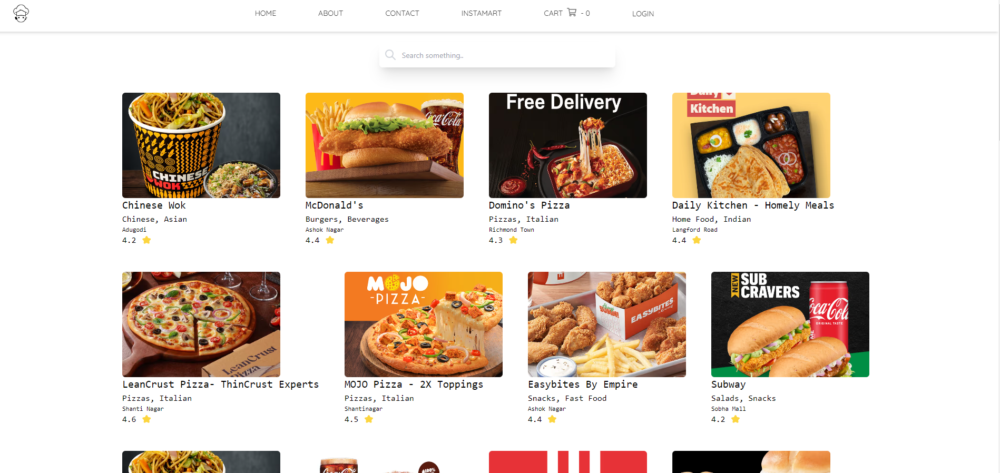
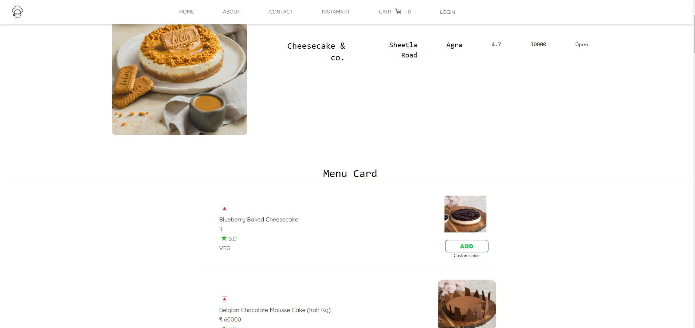

<h1> YumHive </h1>

 
 
 
 
 
 
 
 
 
 
 

<h3> About</h3>

 
  An Food Odering MERN Stack Application buit from scrach using parcel and babel.For frendend used React.js, Redux.js, Parcel, Babel, Tailwind,Framer motion, Typescript and for backend Node.js, express.js, mongoose. By using Parcel as bundler i can access lot of methods given by parcel and i dont need lot of jargan codes which are created when we use create react-app or vite @latest and for global state management used Redux Toolkit.

 * Tools  
* React.js 
* Node.js 
* Express.js 
* MongoDB 
* Typescript 
* Redux.js 
* Parcel  
* Babel  
* Tailwind CSS 
* Framer motion 
* React Router
 
 

 
Live Demo : 
https:// 
 
 
Clone HTTPS : 
https://github.com/syam-ts/YumHive.git
 
Clone SSH : 
git@github.com:syam-ts/YumHive.git

